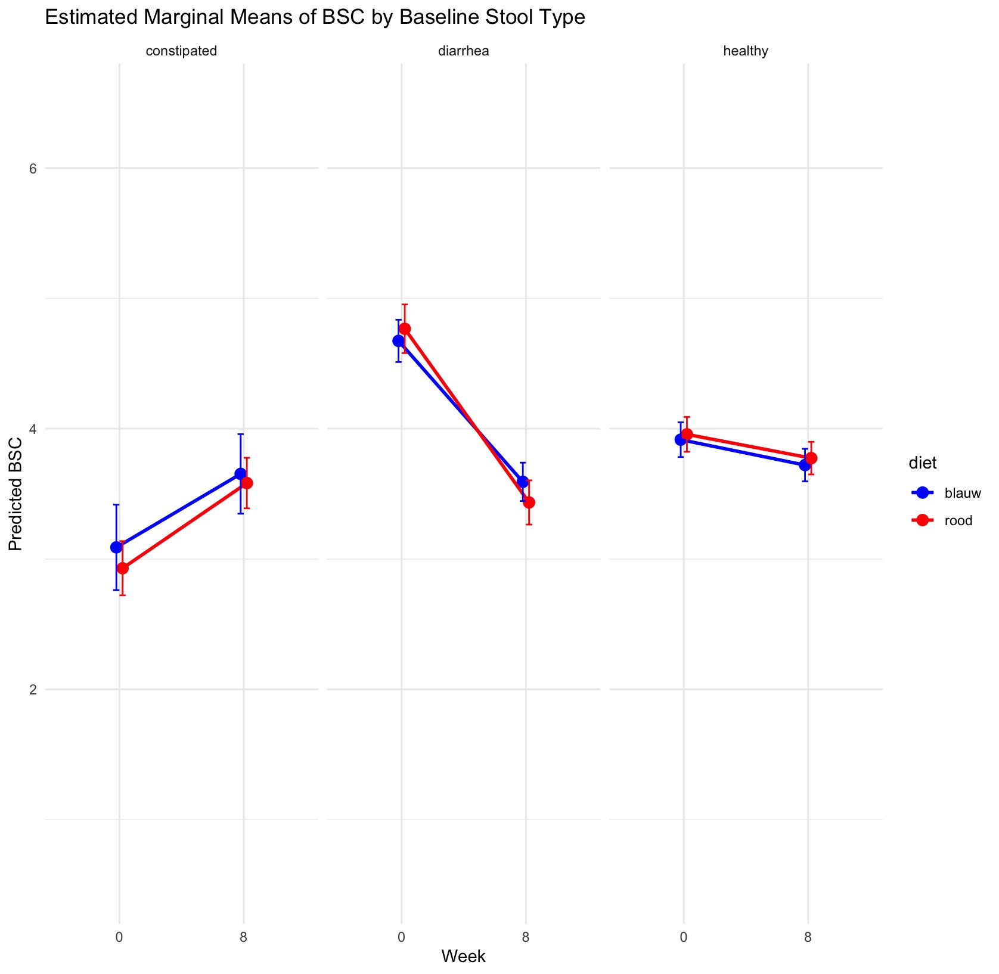

# thesis-replication
This repository will contain some of the analyses and figures I used for my thesis, however due to confidentiality I used mock data for this. 

## Here I will show you some of the figures I created, without exposing the data directly

In this figure we can see the estimated marginal means of the change in Bristol Stool Chart, an indication of stool consistency, looking at 2 different diets, stratified by BSC-baseline
